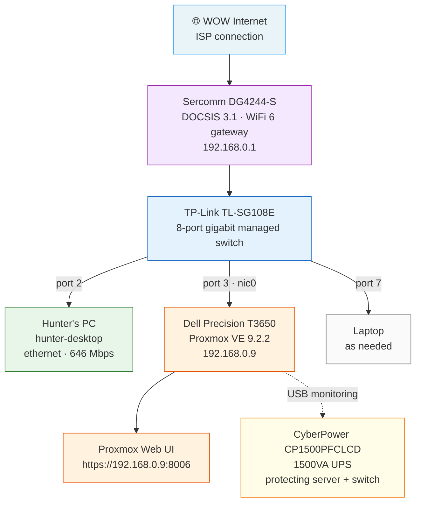
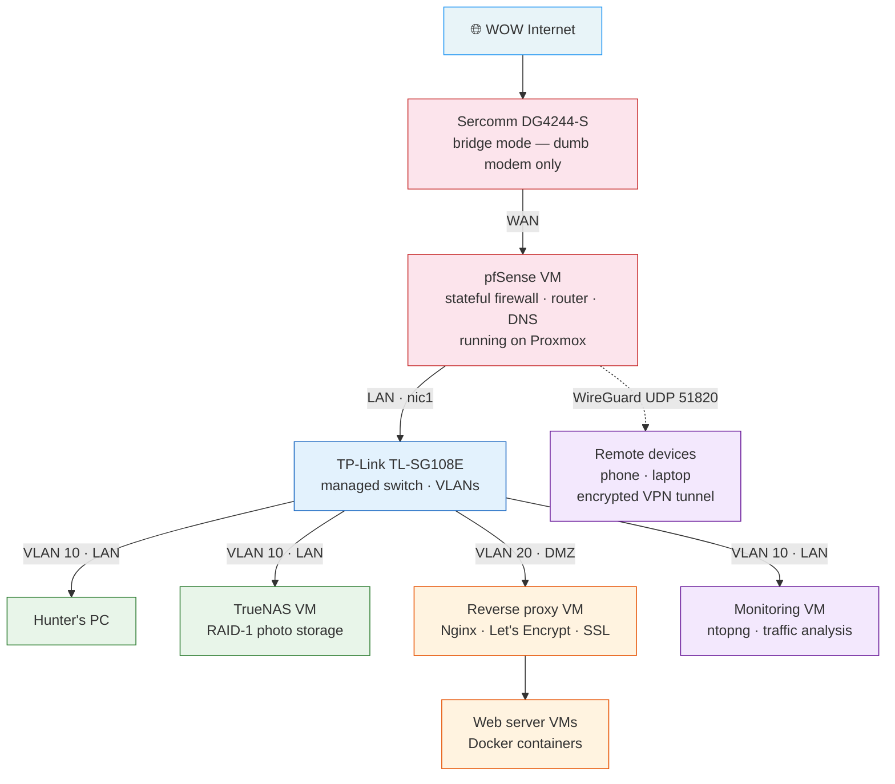

# Home Lab Infrastructure Project

> A self-hosted, enterprise-grade home lab built on a Dell Precision workstation running Proxmox VE — designed for scalability, redundancy, and hands-on development of real-world infrastructure skills.

---

## Table of Contents

- [Inspiration and Background](#inspiration-and-background)
- [Project Goals](#project-goals)
- [Hardware Stack](#hardware-stack)
- [Software Stack](#software-stack)
- [Skills Demonstrated](#skills-demonstrated)
- [Security Principles Applied](#security-principles-applied)
- [Network Topology — Current State](#network-topology--current-state)
- [Completed Setup — Phase 1: Hardware and Hypervisor](#completed-setup--phase-1-hardware-and-hypervisor)
- [Planned Implementations](#planned-implementations)
- [Redundancy and Availability Strategy](#redundancy-and-availability-strategy)
- [Connection to Security Learning Log](#connection-to-security-learning-log)

---

## Inspiration and Background

This project was directly inspired by hands-on experience gained during a shadowing engagement with MetroTech, where I worked alongside a lead infrastructure technician named Dylan. Observing real-world network administration, server management, and hardware deployment made one thing immediately clear: no amount of virtual lab practice fully replicates the decision-making, troubleshooting, and systems thinking required when working with physical infrastructure.

Dylan specifically emphasized **Dell hardware** for its firmware tooling quality — Dell's SupportAssist and Service Tag-based driver management simplify firmware updates, support documentation, and hardware lifecycle management in ways that consumer or white-label hardware cannot match. That recommendation directly influenced the hardware decisions made in this project.

The functional motivation came from a personal use case: I am an active photographer with a growing photo library currently hosted on paid cloud storage. Rather than continuing to pay for services I have no control over, I decided to build my own NAS, implement RAID redundancy, and create a self-hosted storage solution I own completely. The same infrastructure can be extended to serve websites, host a VPN for remote access, and run containerized services — making the build both personally useful and professionally educational.

The broader goal is building the kind of hands-on experience that a classroom or virtual lab environment cannot provide, and documenting it in a way that demonstrates genuine, applicable infrastructure skills to employers.

---

## Project Goals

| Goal | Description | Status |
|------|-------------|--------|
| Self-hosted NAS | Replace paid cloud photo storage with RAID-1 NAS running TrueNAS | 🔄 In progress |
| Proxmox hypervisor | Run all services as isolated VMs on one physical machine | ✅ Complete |
| pfSense firewall | Implement a full software firewall with stateful inspection and VLAN support | 📋 Planned |
| WireGuard VPN | Secure remote access to the home lab from any location | 📋 Planned |
| Power redundancy | UPS protection with automatic graceful shutdown | ✅ Complete |
| Backup strategy | 3-2-1 backup implementation for critical photo data | 🔄 In progress |
| Web hosting | Self-hosted websites with reverse proxy and SSL | 📋 Planned |
| Traffic monitoring | Network flow analysis and anomaly detection | 📋 Planned |
| VLAN segmentation | Isolate web-facing DMZ from personal LAN | 📋 Planned |
| Documentation | Full GitHub documentation of all configurations | 🔄 Ongoing |

---

## Hardware Stack

### Primary Server

| Component | Specification | Purpose |
|-----------|---------------|---------|
| **Machine** | Dell Precision T3650 (Refurbished) | Proxmox hypervisor host — all VMs run on this |
| **CPU** | Intel Core i7-11700 (8 cores / 16 threads, 2.5GHz base / 4.9GHz boost) | VM compute — confirmed 32 virtualization threads via `/proc/cpuinfo` |
| **RAM** | 32GB DDR4 | Supports multiple simultaneous VMs — headroom for pfSense, TrueNAS, monitoring, web servers |
| **Boot drive** | Kingston 1TB NVMe PCIe Gen 3 | Proxmox OS + VM disk images — kept separate from NAS storage drives |
| **NIC (onboard)** | Intel I219-LM (nic0 / e1000e driver) | Current Proxmox management interface — future pfSense WAN port |
| **NIC (add-in)** | Intel 82576 dual-port gigabit PCIe (nic1, nic2 / igb driver) | Future pfSense LAN port (nic1) and DMZ port (nic2) |

> **Why Dell specifically:** Dell's service tag system at dell.com/support maps directly to the exact hardware installed in your machine, providing targeted driver downloads, BIOS update utilities, and warranty lookup without guesswork. This mirrors enterprise-grade hardware management and was a recommendation from a professional infrastructure technician during a MetroTech shadowing engagement.

### Storage

| Component | Specification | Purpose |
|-----------|---------------|---------|
| **NAS drives** | Seagate IronWolf 4TB × 2 (ST4000VNZ06/006, CMR, SATA, 5400 RPM) | RAID-1 mirror pool for photo library — NAS-rated for 24/7 operation |
| **Backup drive** | WD Elements                                                                                                                                                                                                                                                                            External USB drive (5TB) | On-site backup of photo data — part of 3-2-1 backup strategy |

> **Why CMR specifically:** Seagate IronWolf drives are explicitly CMR (conventional magnetic recording), not SMR. ZFS — the filesystem used by TrueNAS — does not perform well with SMR drives under sustained writes. CMR was a deliberate hardware selection decision, not a default.

### Networking

| Component | Specification | Purpose |
|-----------|---------------|---------|
| **Switch** | TP-Link TL-SG108E (8-port, gigabit, managed) | Network distribution — VLAN-capable for future segmentation |
| **Gateway** | Sercomm DG4244-S (DOCSIS 3.1, WiFi 6, bridge mode capable) | ISP gateway — will be placed into bridge mode when pfSense takes over routing |
| **Ethernet** | 100ft flat Cat6 (pure copper) | Long-haul run from server room to workstation — gigabit capable |

### Power Protection

| Component | Specification | Purpose |
|-----------|---------------|---------|
| **UPS** | CyberPower CP1500PFCLCD (1500VA / 1000W, PFC Sinewave) | Battery backup + automatic graceful shutdown via USB monitoring |

> **Why PFC Sinewave:** The Dell T3650 uses an 80Plus Gold certified Active PFC power supply. Simulated/stepped sine wave UPS units can cause instability with Active PFC power supplies. PFC Sinewave output was a deliberate technical requirement, not just a feature upgrade.

---

## Software Stack

| Software | Role | Notes |
|----------|------|-------|
| **Proxmox VE 9.2** | Type-1 hypervisor — bare metal VM management | Installed on NVMe, managing all other services as VMs |
| **TrueNAS SCALE** | NAS operating system — ZFS storage management | Planned VM for photo storage with RAID-1 mirror |
| **pfSense** | Software firewall and router | Planned VM — will replace gateway routing with full stateful inspection |
| **WireGuard** | Modern VPN protocol | Planned — integrated into pfSense for secure remote access |
| **Nginx / Traefik** | Reverse proxy | Planned — SSL termination and traffic routing for web services |
| **Let's Encrypt** | Automated SSL certificate management | Planned — automatic HTTPS for all hosted services |
| **DuckDNS** | Dynamic DNS | Planned — resolves home public IP to a stable hostname for VPN and web access |
| **ntopng** | Network traffic analysis | Planned — flow monitoring and anomaly detection |
| **Docker** | Container orchestration | Planned — web services and applications |
| **Balena Etcher** | Bootable USB creation | Used during Proxmox installation |
| **Debian Linux (Proxmox base)** | Underlying OS for shell operations | apt package management, bash scripting |

---

## Skills Demonstrated

### Infrastructure and Virtualization
- Type-1 hypervisor deployment and configuration (Proxmox VE)
- VM architecture planning — resource allocation, network assignment, storage passthrough
- Hardware selection for virtualization workloads (VT-x / VT-d verification)
- PCIe NIC installation and driver verification (Intel e1000e, igb)
- BIOS firmware update procedure on enterprise hardware
- Intel virtualization flag verification via `/proc/cpuinfo`

### Storage Engineering
- NAS drive selection criteria — CMR vs SMR, SATA vs NVMe, NAS-rated vs desktop
- ZFS storage model understanding — vdevs, pools, datasets, scrubs
- RAID-1 mirror configuration rationale — redundancy vs backup distinction
- Drive health and monitoring principles (IronWolf Health Management)

### Networking
- Managed switch configuration and port assignment
- Network topology design — gateway, switch, server, endpoint relationships
- NIC role planning — management interface, WAN, LAN, DMZ
- Understanding double NAT and bridge mode resolution
- Static IP assignment and subnet configuration
- Ethernet cable management and infrastructure routing

### Linux System Administration
- Proxmox shell operations (apt, sed, echo, lsblk, egrep)
- Package repository configuration (switching from enterprise to no-subscription repo)
- System upgrade and package management (apt-get update / upgrade)
- Service verification and system health checks

### Power and Availability Engineering
- UPS sizing for server workloads (VA rating, load calculation)
- PFC Sinewave selection for Active PFC power supplies
- USB-based UPS monitoring for automated graceful shutdown
- Distinguishing RAID redundancy from backup — uptime vs recovery strategy

### Documentation and Professional Practice
- Hardware selection documentation and justification
- Network topology diagramming
- GitHub project documentation targeting employer audiences
- Troubleshooting methodology — systematic isolation, BIOS recovery, diagnostic LED interpretation

---

## Security Principles Applied

This project directly extends concepts from my [Security Learning Log](../security-learning-log), applying the CIA Triad and defense-in-depth principles in a hands-on physical environment.

### Confidentiality
- **Planned — WireGuard VPN:** All remote access to the home lab will be encrypted using WireGuard, a modern VPN protocol built on ChaCha20 symmetric encryption and Curve25519 key exchange. Remote clients authenticate via cryptographic keypairs, not passwords. No unencrypted traffic will traverse the public internet to reach internal resources.
- **Planned — pfSense firewall rules:** Default-deny inbound policy. Only explicitly permitted traffic can reach internal services.
- **Planned — VLAN segmentation:** Public-facing web services will be isolated in a DMZ network segment, preventing lateral movement from a compromised web server to the personal NAS or LAN.

### Integrity
- **ZFS filesystem (TrueNAS):** ZFS uses end-to-end checksumming on all data blocks. Silent data corruption — bit rot — is detected automatically during scrubs and corrected using the RAID-1 mirror. This is integrity assurance at the storage layer, not just the network layer.
- **Snapshot scheduling:** Planned ZFS snapshots provide point-in-time recovery from accidental deletion or corruption without requiring a full restore.
- **CMR drive selection:** CMR recording technology provides more consistent write behavior than SMR, reducing the risk of write-ordering errors under sustained load — relevant to ZFS write patterns.

### Availability
- **RAID-1 mirror:** Both IronWolf drives maintain identical copies of all data simultaneously. A single drive failure causes zero downtime — the pool continues operating on one drive while the failed drive is replaced and rebuilt.
- **UPS power protection:** The CyberPower CP1500PFCLCD provides battery backup on the server and switch. USB monitoring integration will allow Proxmox and TrueNAS to detect a power event and initiate a graceful shutdown before battery depletion — protecting ZFS from mid-write corruption.
- **3-2-1 backup strategy (in progress):** Three copies of photo data: the live RAID-1 pool, the on-site external USB backup, and a planned cloud or off-site third copy. Two different media types. One copy off-site.
- **Static IP on server:** The Proxmox management interface is assigned a static IP (192.168.0.9) ensuring the server remains reachable from the local network regardless of DHCP lease changes.

### Defense in Depth
This build is designed around the principle that no single security control should be relied upon exclusively:

```
Internet → Sercomm gateway (bridge mode) → pfSense firewall (stateful inspection)
        → VLAN-segmented switch → individual VMs (isolated per function)
        → reverse proxy (SSL termination) → web services (DMZ only)

Remote access → WireGuard VPN (encrypted tunnel) → pfSense LAN → internal resources
```

Each layer provides independent protection. Compromise of one layer does not automatically grant access to the next.

---

## Network Topology — Current State



---

## Network Topology — Planned State (post-pfSense)



---

## Completed Setup — Phase 1: Hardware and Hypervisor

### 1. Hardware Selection and Procurement

All hardware was researched and selected before purchase with scalability explicitly in mind — the goal was to avoid buying gear that would need to be replaced as the project expanded.

**Key decision: Dell Precision T3650 over cheaper alternatives.** A consumer desktop would have been less expensive, but Dell's enterprise-grade tooling (service tag firmware management, iDRAC-adjacent monitoring, documented PCIe slot configuration) justified the investment. This directly reflects Dylan's recommendation from MetroTech — professionals choose hardware with ecosystem support, not just specs.

**Key decision: managed switch over unmanaged.** The TP-Link TL-SG108E supports 802.1Q VLANs, QoS, and IGMP snooping. An unmanaged switch would have required replacement when VLAN segmentation becomes necessary. Buying the managed switch now avoided that cost.

**Key decision: PFC Sinewave UPS.** The Dell T3650 uses an Active PFC power supply. Cheaper stepped-sine wave UPS units can cause instability or damage Active PFC supplies during power transfer. The CyberPower CP1500PFCLCD outputs a true sine wave — the same quality as utility power — making it safe for sensitive electronics.

### 2. Physical Hardware Installation

- Installed two Seagate IronWolf 4TB drives using 6-32 UNC mounting screws into the T3650 drive bays
- Installed Intel 82576 dual-port NIC into an available PCIe slot
- Verified all SATA data cable connections from drives to motherboard
- Connected all hardware to UPS battery-protected outlets (server + switch)
- Connected UPS to server via USB for power monitoring integration
- Ran 100ft flat Cat6 ethernet cable for workstation connectivity
- Completed cable management using adhesive raceways and cable clips

### 3. BIOS Firmware Updates

Before any OS installation, all firmware was updated to current versions via Dell's service tag system:

| Update | Version | Importance |
|--------|---------|------------|
| Dell Precision T3650 BIOS | 08 Jun 2026 | Critical |
| Intel Management Engine Components | 10 Dec 2025 | Recommended |
| Intel PCIe Ethernet Controller Driver | 08 Oct 2025 | Recommended |
| Intel Chipset Device Software | 02 Dec 2024 | Critical |
| Intel UHD Graphics Driver | 16 Apr 2026 | Critical |
| Intel Rapid Storage Technology | 14 Feb 2023 | Critical |
| Intel Serial IO Driver | 23 Aug 2021 | Critical |

> **Note:** A BIOS recovery procedure was required after the initial flash caused a display initialization failure — a known issue that occurs when BIOS resets display output priority. Recovery was performed using Dell's built-in USB recovery mode (`BIOS_IMG.rcv` file on FAT32 USB drive, Ctrl+Esc on boot), which successfully restored the system without data loss. This troubleshooting experience is documented separately in the troubleshooting log.

### 4. Proxmox VE Installation and Configuration

**Installation:**
- Flashed Proxmox VE 9.2.2 ISO to USB using Balena Etcher
- Booted from USB via F12 one-time boot menu
- Installed Proxmox onto Kingston 1TB NVMe (keeping IronWolf drives unconfigured for TrueNAS)
- Configured static network: `192.168.0.9/24`, gateway `192.168.0.1`
- Selected onboard Intel NIC (nic0 / e1000e) as management interface

**Post-installation configuration:**
```bash
# Switched from enterprise to no-subscription repository
echo "deb http://download.proxmox.com/debian/pve bookworm pve-no-subscription" \
  > /etc/apt/sources.list.d/pve-no-subscription.list

# Updated all packages
apt-get update && apt-get upgrade -y
```

**Virtualization verification:**
```bash
# Confirms all 16 threads report VMX virtualization support
egrep -c '(vmx|svm)' /proc/cpuinfo
# Output: 32
```

**Storage confirmed available for TrueNAS:**
```bash
lsblk
# nvme0n1 — Kingston 1TB (Proxmox OS)
# sda     — Seagate IronWolf 4TB (unconfigured)
# sdb     — Seagate IronWolf 4TB (unconfigured)
```

### 5. Network Configuration

| Port | Device | Connection type |
|------|--------|----------------|
| Port 1 | Sercomm DG4244-S (LAN) | Cat6 patch — internet upstream |
| Port 2 | Hunter's PC | 100ft flat Cat6 — confirmed 646 Mbps via speed test |
| Port 3 | Dell T3650 (nic0 onboard) | Cat6 patch — Proxmox management |
| Port 4–6 | — | Available |
| Port 7 | Laptop | As needed |
| Port 8 | — | Available |

**Gateway status:** The Sercomm DG4244-S has bridge mode available directly on the main dashboard (Gateway > At a Glance). Bridge mode will be enabled when pfSense is ready to take over routing — it is deliberately left disabled until that point to avoid network interruption.

---

## Planned Implementations

### Phase 2 — TrueNAS SCALE + RAID-1 Storage (next)

The two IronWolf drives are physically installed and visible to Proxmox but unconfigured. The next phase:

1. Download TrueNAS SCALE ISO into Proxmox local storage via URL
2. Create TrueNAS VM — assign 8GB RAM minimum for ZFS ARC cache
3. Configure disk passthrough — pass `sda` and `sdb` directly to TrueNAS VM using disk-by-id identifiers (stable across reboots, unlike `/dev/sda` naming)
4. Install TrueNAS SCALE inside VM
5. Create ZFS mirror pool — `sda` + `sdb` as RAID-1 mirror vdev
6. Create dataset for photo library
7. Enable SMB sharing for Windows client access
8. Configure UPS USB passthrough to TrueNAS for power event monitoring
9. Schedule automated scrubs (monthly) and snapshots (daily/weekly)
10. Set up backup job to external USB drive (3-2-1 strategy)

### Phase 3 — pfSense Firewall and Router

1. Enable Intel VT-d / IOMMU in Proxmox for PCIe passthrough
2. Pass 82576 dual-port NIC to pfSense VM
3. Create pfSense VM, install from ISO
4. Assign nic1 (82576 port 1) as WAN — physical cable moves from gateway to nic1 onboard not needed — gateway LAN port → nic0 becomes WAN
5. Assign nic1 (82576 port 1) as LAN → connects to switch
6. Configure firewall rules — default deny inbound, allow established
7. Configure DNS resolver (Unbound)
8. Enable bridge mode on Sercomm gateway
9. Verify all LAN devices can reach internet through pfSense

### Phase 4 — WireGuard VPN

1. Install WireGuard package within pfSense
2. Create tunnel interface, generate server keypair
3. Configure tunnel subnet (10.0.0.0/24)
4. Add firewall rule — allow UDP 51820 inbound on WAN
5. Set up DuckDNS dynamic DNS client in pfSense
6. Generate client keypairs for phone and laptop
7. Configure WireGuard app on each client device
8. Test from outside the network (mobile data, not local WiFi)
9. Configure split tunneling — only LAN-destined traffic routes through VPN

### Phase 5 — VLAN Segmentation and DMZ

1. Configure VLANs on TP-Link TL-SG108E (802.1Q)
2. Create pfSense VLAN interfaces — VLAN 10 (LAN), VLAN 20 (DMZ)
3. Configure inter-VLAN firewall rules — DMZ cannot initiate connections to LAN
4. Move personal devices to VLAN 10
5. Place web-facing services in VLAN 20

### Phase 6 — Web Hosting and Reverse Proxy

1. Create reverse proxy VM — Nginx or Traefik
2. Register domain name via Cloudflare Registrar
3. Configure Cloudflare DNS and DDoS protection (proxied records — hides home IP)
4. Automate Let's Encrypt SSL certificate issuance and renewal
5. Configure pfSense port forwarding — ports 80/443 to reverse proxy
6. Create web server VMs or Docker containers per project
7. Deploy hosted projects with HTTPS from public internet

### Phase 7 — Monitoring and Observability

1. Create monitoring VM or LXC container
2. Install ntopng (community edition) for network flow analysis
3. Configure pfSense NetFlow export to ntopng
4. Set up Grafana + InfluxDB or Prometheus for system metrics
5. Configure alerting for anomalous traffic or resource exhaustion

---

## Redundancy and Availability Strategy

This build applies a multi-layer approach to availability — each layer addresses a distinct failure mode:

| Failure scenario | Protection layer | Implementation |
|-----------------|-----------------|----------------|
| Single drive failure | RAID-1 mirror | ZFS mirror vdev — zero downtime, automatic |
| Accidental file deletion | ZFS snapshots | Scheduled snapshots — point-in-time recovery |
| Ransomware / corruption | External backup | USB drive backup — disconnected when not syncing |
| Power outage | UPS battery | CyberPower CP1500 — graceful shutdown via USB |
| Catastrophic loss (fire, theft) | Off-site backup | Planned — third copy stored away from home |
| Network configuration loss | Documentation | All configs version-controlled in this repository |

**The RAID-1 / backup distinction — a common misconception:**
RAID-1 is a high-availability tool, not a backup. It protects against a single drive failure while keeping the system running. It does not protect against:
- Accidental deletion (both drives reflect the deletion immediately)
- Ransomware (both drives are encrypted simultaneously)
- Physical disaster (both drives in the same location)

The external USB drive, ZFS snapshots, and planned off-site copy address these scenarios independently. All four layers together constitute a genuine backup and recovery strategy.

---

## Connection to Security Learning Log

| Security concept | Application in this lab |
|-----------------|------------------------|
| **CIA Triad — Confidentiality** | WireGuard VPN encryption for remote access; pfSense firewall default-deny inbound; planned VLAN isolation preventing lateral movement |
| **CIA Triad — Integrity** | ZFS end-to-end checksumming detects and corrects silent data corruption; CMR drives provide stable write behavior under ZFS workloads |
| **CIA Triad — Availability** | RAID-1 redundancy; UPS graceful shutdown; 3-2-1 backup strategy; static IP for management access |
| **Defense in depth** | Multiple independent security layers — gateway, firewall, VLAN, VPN — no single point of control |
| **Least privilege** | Planned pfSense firewall rules permit only explicitly required traffic; DMZ devices cannot initiate connections to LAN |
| **Network segmentation** | Planned VLAN separation of personal LAN from public-facing DMZ |
| **Cryptographic key management** | WireGuard peer authentication via public/private keypairs — no shared secrets or passwords |
| **Physical security** | UPS protects hardware from power events; server located in controlled home environment |

---

## Current Proxmox Resource Summary

| Resource | Installed | In use (Proxmox host only) |
|----------|-----------|---------------------------|
| CPU | i7-11700 · 8 cores · 16 threads | ~0% (headroom for 5–6 VMs) |
| RAM | 32 GB DDR4 | ~5.8% |
| Boot storage | 1 TB NVMe | ~4.4% |
| NAS storage | 2 × 4TB IronWolf | Unconfigured — pending TrueNAS |

---

*Documentation maintained as part of [homelab-and-troubleshooting-log](../README.md)*
*Last updated: June 2026*
