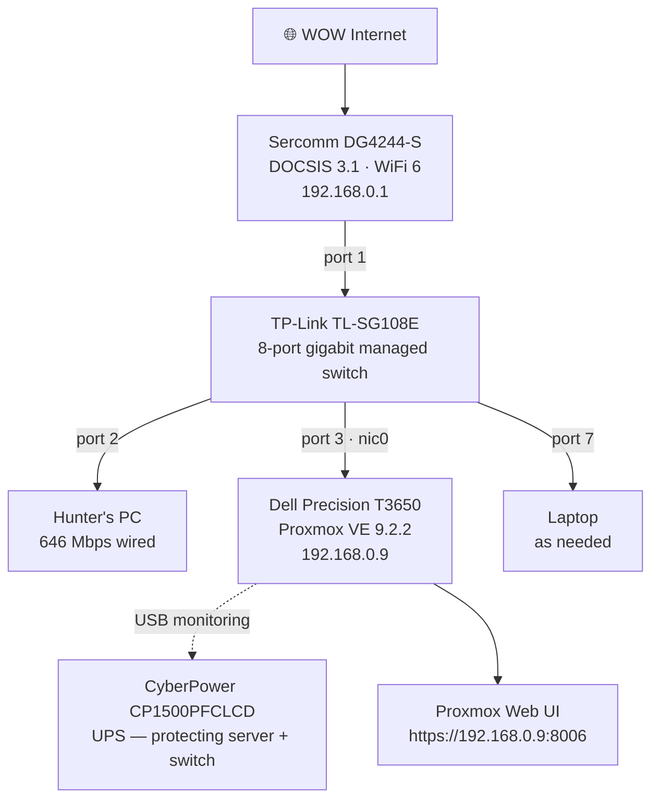
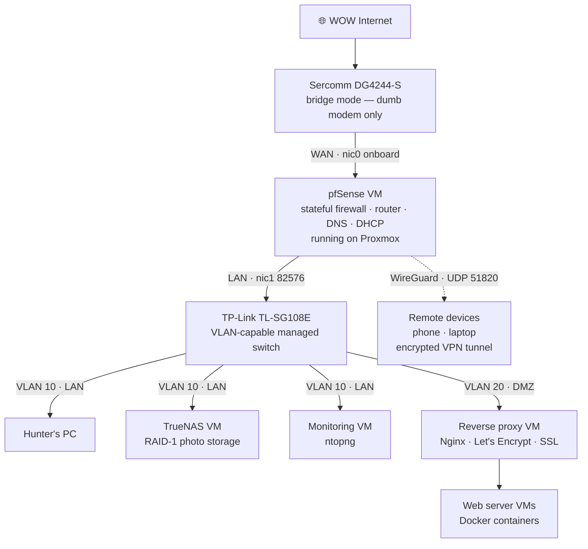

# Network Topology

Network diagrams, switch port assignments, and IP addressing scheme for the home lab.

---

## Current State

The current network is a standard home LAN with the Sercomm gateway handling all routing. Proxmox is accessible on the local network. pfSense is not yet deployed and the full firewall architecture is in the planned state diagram below.

---

## Planned State — Post pfSense

When pfSense is deployed as a VM, the Sercomm gateway will be placed into bridge mode (confirmed available on its dashboard). pfSense takes over all routing, firewalling, DNS, and DHCP. The onboard NIC moves from the switch to the gateway, and the 82576 NIC port 1 becomes the LAN connection.

---

## Switch Port Assignments

**TP-Link TL-SG108E — 8 ports**

| Port | Device | Cable | Notes |
|------|--------|-------|-------|
| 1 | Sercomm gateway (LAN port) | Cat6 patch | Internet upstream |
| 2 | Hunter's PC | 100ft flat Cat6 | 646 Mbps confirmed |
| 3 | Dell T3650 — nic0 (onboard) | Cat6 patch | **Changes when pfSense is deployed** — see below |
| 4 | Available | — | |
| 5 | Available | — | |
| 6 | Available | — | |
| 7 | Laptop | Cat6 patch | As needed |
| 8 | Available | — | |

**Port 3 NIC change when pfSense deploys:**

| Phase | Port 3 connects to | Reason |
|-------|-------------------|--------|
| Current (pre-pfSense) | nic0 — onboard Intel I219 | Proxmox management NIC |
| Future (post-pfSense) | nic1 — 82576 port 1 | pfSense LAN interface |

When pfSense goes live, nic0 physically moves from the switch to the gateway, that becomes pfSense's WAN connection. nic1 on the 82576 card then plugs into port 3 as pfSense's LAN.

---

## IP Addressing Scheme

| Device | IP | Assignment |
|--------|----|-----------|
| Sercomm gateway | 192.168.0.1 | Gateway default |
| Dell T3650 (Proxmox) | 192.168.0.9 | Static: configured during Proxmox install |
| Hunter's PC | DHCP | Assigned by gateway |
| WireGuard tunnel subnet | 10.0.0.0/24 | Planned: VPN clients |

**Why static IP for the server:**
If the Proxmox management IP changes due to a DHCP lease renewal, the web UI becomes unreachable until the new IP is found. A static assignment ensures `https://192.168.0.9:8006` always works.

---

## Planned VLAN Architecture

When pfSense and the managed switch are fully configured:

| VLAN | ID | Subnet | Purpose |
|------|----|--------|---------|
| LAN | 10 | 192.168.10.0/24 | Personal devices, server management, NAS access |
| DMZ | 20 | 192.168.20.0/24 | Public-facing web servers and reverse proxy |

**DMZ isolation rule (pfSense):** Traffic from VLAN 20 (DMZ) cannot initiate connections to VLAN 10 (LAN). A compromised web server in the DMZ has no path to the personal NAS or workstation. Responses to established LAN-initiated connections are permitted.
